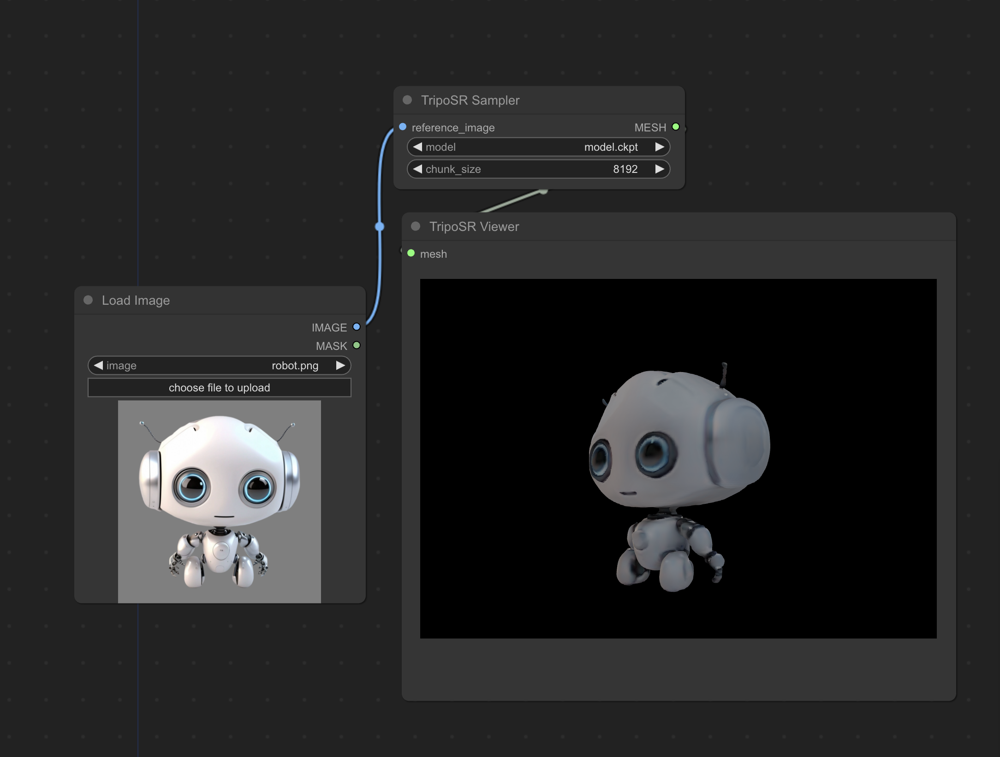

# ComfyUI-Flowty-TripoSR

This is a custom node that lets you use TripoSR right from ComfyUI.

[TripoSR](https://github.com/VAST-AI-Research/TripoSR) is a state-of-the-art open-source model for fast feedforward 3D reconstruction from a single image, collaboratively developed by Tripo AI and Stability AI. (TL;DR it creates a 3d model from an image.)



I've created this node for experimentation, feel free to submit PRs for performance improvements etc.

### Installation:
* Install ComfyUI
* Clone this repo into ```custom_nodes```:
  ```shell
  $ cd ComfyUI/custom_nodes
  $ git clone https://github.com/flowtyone/ComfyUI-Flowty-TripoSR.git
  ```
* Install dependencies:
  ```shell
  $ cd ComfyUI-Flowty-TripoSR
  $ pip install -r requirements.txt
  ```
* [Download TripoSR](https://huggingface.co/stabilityai/TripoSR/blob/main/model.ckpt) and place it in ```ComfyUI/models/checkpoints```
* Start ComfyUI (or restart)

Special thanks to MrForExample for creating [ComfyUI-3D-Pack](https://github.com/MrForExample/ComfyUI-3D-Pack). Code from that node pack was used to display 3d models in comfyui.

This is a community project from [flowt.ai](https://flowt.ai). If you like it, check us out!

<picture>
 <source media="(prefers-color-scheme: dark)" srcset="logo-dark.svg" height="50">
 <source media="(prefers-color-scheme: light)" srcset="logo.svg" height="50">
 
</picture>